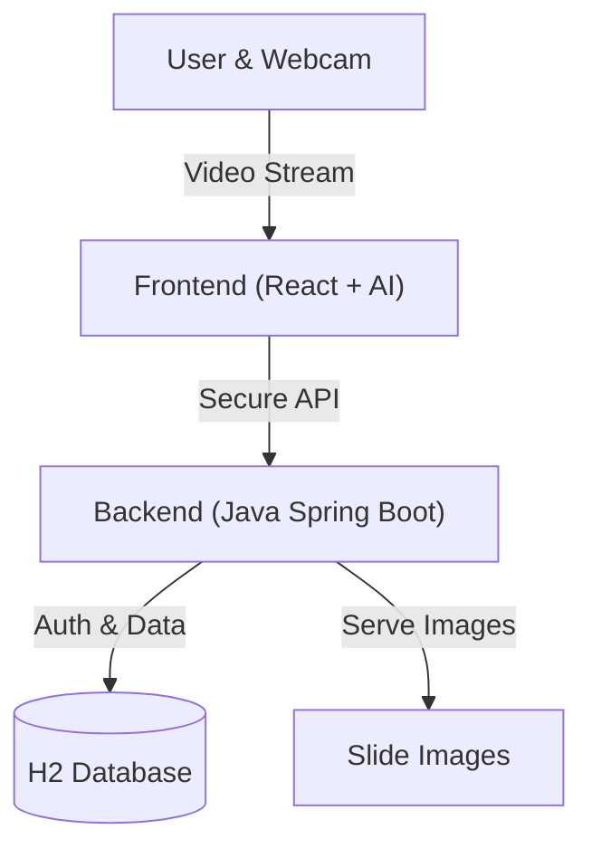

# AI Virtual Presentation System

A futuristic, touchless presentation tool that turns your hand into a virtual laser pointer and pen. Control slides and draw annotations using only a webcam.

## 🏗️ Architecture Overview

This project is a **Full-Stack Web Application**, containerized with Docker.

---

## 🎨 Frontend (The "Brain" & "Eyes")
**Tech Stack:** React, Vite, TailwindCSS, MediaPipe, Canvas API.

The Frontend handles all AI processing locally:
1.  **Vision (MediaPipe)**: Tracks 21 hand landmarks in real-time.
2.  **Logic Engine**: Detects pinches for drawing and gestures for navigation.
3.  **Authentication**: Manages JWT tokens for secure access.

## ⚙️ Backend (The "Vault")
**Tech Stack:** Java, Spring Boot 3, Spring Security, JPA, H2.

The Backend provides a secure API:
1.  **Security**: Standard Username/Password Login (JWT).
2.  **Slide Management**: `POST /api/upload` to store presentation slides.
3.  **State Server**: `GET /api/current-state` to sync slides.

## 🚀 Key Features
*   **Secure Access**: User account creation and login protection.
*   **Pinch-to-Draw**: Hold a virtual pen by pinching fingers.
*   **Undo All**: Instantly clear slide annotations.
*   **Touchless Navigation**: Switch slides with hand gestures.
*   **Zero Latency**: All hand tracking is Client-Side.
